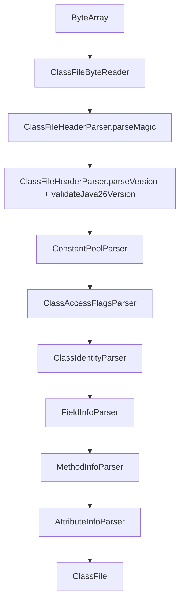

# Classfile Implementation Coverage

This document summarizes current `jvm-classfile` coverage. `docs/spec-coverage.md` remains the line-by-line ledger; this file explains the implementation shape and verification strategy.

## Scope

`jvm-classfile` owns JVMS classfile bytes and models:

- magic and version validation through Java 26 (`major_version = 70`, preview minor `65535`)
- constant pool entries and unusable two-slot entries
- access flags and class identity
- fields, methods, descriptors, and attributes
- Code attributes and instruction operand validation
- classfile writing and round-trip fixtures
- offset/source-aware parser diagnostics

ASM is not used in production parser/writer code. `jvm-asm-oracle` is used only by tests to compare facts or generate fixtures.

## Parser pipeline

Every reader failure records source, offset, needed bytes, and remaining bytes. Attribute body failures are wrapped with owner path and byte offset.

## Attribute coverage gate

`AttributeParserCoverageTest` enumerates every standard JVMS attribute currently tracked by the project and requires implemented entries to bind to:

- attribute name
- owner scope
- parser object name
- covering parser test class

Current standard attributes are classified as parsed, including:

- `ConstantValue`, `Code`, `StackMapTable`, `Exceptions`
- nested/member metadata such as `InnerClasses`, `EnclosingMethod`, `NestHost`, `NestMembers`
- debug/local metadata such as `SourceFile`, `SourceDebugExtension`, `LineNumberTable`, `LocalVariableTable`, `LocalVariableTypeTable`
- annotations and type annotations
- `BootstrapMethods`, `MethodParameters`
- module metadata
- `Record`, `PermittedSubclasses`

Unknown attributes can still be preserved as `UnknownAttributeInfo` when a caller does not register a typed parser.

## Instruction and Code attribute coverage

Code parsing validates opcode forms and operands in the classfile layer before interpretation. Coverage includes:

- fixed-length instructions
- variable-length `tableswitch`/`lookupswitch`
- `wide`
- constant-pool operand kind checks for class, field, method, interface method, dynamic, and loadable constants
- special method-name restrictions for invocation instructions
- reserved opcode separation through interpreter opcode table coverage

Execution coverage is tracked in `jvm-interpreter`, but classfile decoding/validation coverage starts here.

## Writer and round-trip coverage

`ClassFileWriter` writes classfile models back into bytes, including header, constant pool, identity, members, and attributes. Round-trip tests protect parser/writer symmetry for supported structures.

Differential tests compare parser facts with `javap -v` on compiled fixtures, so modeled names, descriptors, versions, interfaces, fields, and methods stay aligned with the JDK tools.

## Negative corpus

`MalformedClassfileCorpusTest` rejects structural bad inputs with expected exception classes and message fragments:

- truncated header
- bad magic
- unsupported future major version
- zero `constant_pool_count`
- truncated UTF-8 constant

This corpus is intentionally small and should grow whenever a parser bug is found.

## Known gaps / next work

- Runtime class loading from classpath/jar entries is not owned by this module yet; `jvm-classfile` starts once bytes are provided.
- Complete semantic validation beyond classfile structural constraints remains split across verifier, linker, and interpreter work.
- Any future JVMS 26 attribute additions must update `AttributeParserCoverage`, parser implementation, and focused tests together.