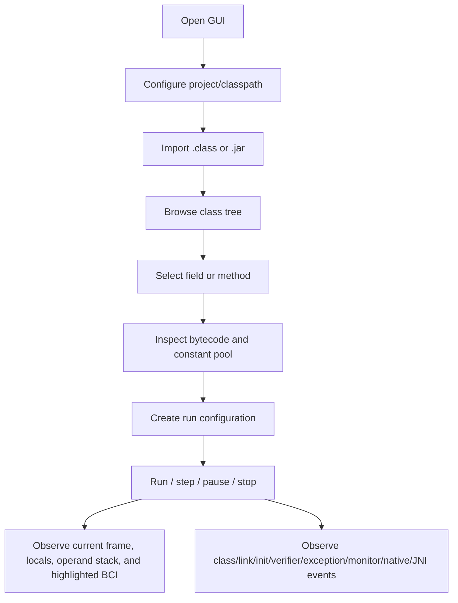
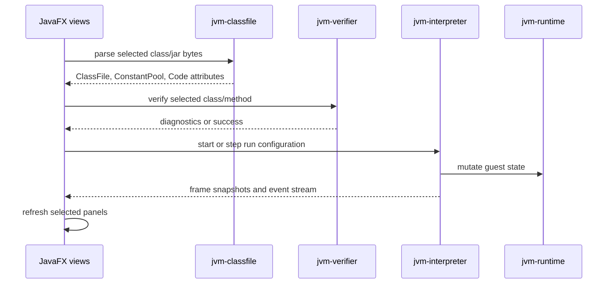

# GUI Workflow

This document describes the JavaFX workflow for the visual JVM debugger. The GUI is a consumer of classfile, verifier, interpreter, host, native, and simulated-JNI state; it does not define VM semantics.

## User workflow

The intended interaction is class-first: import artifacts, choose a class/member, inspect static structure, then execute or step while observing state snapshots and event panels.

## Current GUI surfaces

The `jvm-gui` module already contains focused JavaFX view/model classes for the main visualizer surfaces:

| Surface | Purpose |
| --- | --- |
| classpath/import views | Select project inputs and import class/jar artifacts. |
| class tree | Browse imported classes. |
| member list | Show fields and methods from a selected `ClassFile`. |
| bytecode instruction view | Render decoded bytecode with offsets and operands. |
| constant pool view | Render constant pool entries and unusable two-slot placeholders. |
| debugger control bar | Present run, step, pause, and stop actions. |
| current frame, locals, operand stack | Render execution snapshots from the interpreter. |
| class loading/linking/initialization events | Show class lifecycle events. |
| verifier diagnostics | Show verifier failures and rule details. |
| exception unwinding | Show thrown, unwound, handler-matched, and uncaught events. |
| monitor events | Show guest monitor enter/exit behavior. |
| invokedynamic/condy events | Show dynamic constant and call-site activity. |
| host delegation events | Show opaque host boundary decisions and returns. |
| native intrinsic frames | Show native intrinsic entry/return/throw/fallback. |
| simulated JNI calls | Show JNI helper calls, results, and pending exceptions. |
| JNI upcall nesting | Show JNI calls that re-enter interpreted guest methods. |

Many panels are currently model/view scaffolding. Engine wiring and event completeness remain planned work.

## Data flow

GUI state should be derived from immutable snapshots whenever possible. JavaFX controls should not hold authoritative VM state beyond current selection and presentation state.

## Static inspection flow

1. Import a class or jar.
2. Parse bytes with `jvm-classfile`.
3. Populate class tree from parsed identities.
4. Selecting a class populates:
   - member list from classfile fields/methods
   - constant pool view from `ConstantPool`
   - class metadata and attributes
5. Selecting a method with a `Code` attribute populates bytecode instructions through the interpreter/classfile decoder surface.

This flow must display parser diagnostics rather than crashing the UI when a classfile is malformed.

## Debug execution flow

Debugger actions have these intended meanings:

| Action | Meaning |
| --- | --- |
| `Run` | Execute until completion, breakpoint, pause, or uncaught guest exception. |
| `Step` | Execute one bytecode instruction or one debugger-defined step unit. |
| `Pause` | Request cooperative pause at the next safe boundary. |
| `Stop` | Terminate the current guest execution session and release transient state. |

Each step should update:

- current frame identity and bytecode offset
- highlighted instruction
- local variables
- operand stack
- heap/static summaries when exposed
- emitted event panels

## Event stream contract

GUI event panels are fed by the public event stream contract documented in `docs/event-stream-contract.md`. Event order is controlled by monotonically increasing sequence numbers.

The GUI should keep event families separate so users can filter VM behavior:

- class loading, linking, and initialization
- verifier diagnostics
- exception unwinding
- monitors
- `invokedynamic` and dynamic constants
- host delegation boundaries
- native intrinsic frames
- simulated JNI calls
- JNI upcall nesting

## Native and host visualization

Native and host behavior must be visible but not confused with interpreted bytecode:

- host delegation is an opaque boundary: delegated/rejected/returned/failed
- VM intrinsic calls are native frames: entered/returned/threw/fell-back
- simulated JNI calls show helper name, arguments, local-frame depth, result, and pending exception
- JNI upcalls show nesting depth and interpreted target method

This is important because standard-library classes may be host delegated, while guest application classes remain interpreted by default.

## Design invariants

1. GUI consumes engine snapshots and events; it does not implement JVM semantics.
2. Parser/verifier/interpreter/native failures are displayed as diagnostics or guest events, not as unhandled JavaFX crashes.
3. Selection state and execution state are separated so browsing a class does not mutate a running guest VM.
4. Host delegation, VM intrinsics, simulated JNI, and JNI upcalls are distinct visual concepts.
5. The GUI must remain usable with incomplete VM coverage by showing precise unsupported-path diagnostics.

## Known gaps / next work

- Wire project/classpath import to a persistent VM session model.
- Connect debugger controls to a step-capable execution engine instead of one-shot execution only.
- Add stable snapshot models for current frame, heap/static summaries, and highlighted instruction.
- Complete event production in engine modules and feed all GUI event panels from one ordered stream.
- Add JavaFX smoke tests that cover import, selection, bytecode display, stepping, and event rendering.
