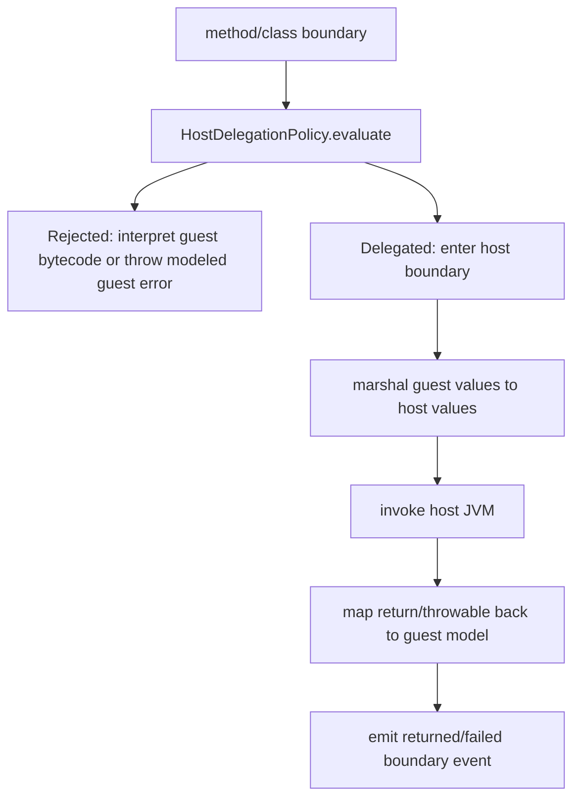

# Host Delegation Policy

This document defines the host-JVM delegation policy for classes and methods that should not be interpreted bytecode-by-bytecode. It records the intended boundary before the `jvm-host` module grows a concrete bridge.

## Goal

The VM interprets guest application classes by default. Host delegation is an explicit optimization and compatibility boundary for trusted platform/library code, especially Java standard library classes that are expensive or unnecessary to model instruction-by-instruction.

Delegation must improve performance without hiding guest semantics for classes selected for interpretation.

## Current implementation state

`jvm-host` is currently a reserved module boundary. The GUI already has a host-delegation event model (`HostDelegationEventsView`) with actions for delegated, rejected, returned, and failed calls. Full policy evaluation, bridge marshalling, and execution are still planned work.

Current documentation and tests therefore treat host delegation as a design contract:

- guest classes default to interpreted execution
- JDK/platform classes may be delegated when the policy allows
- user whitelists may delegate specific classes or packages
- every boundary crossing must be observable as an opaque host-delegation event
- host delegation must not be used as an accidental fallback for unsupported bytecode

## Policy inputs

A final `HostDelegationPolicy` should evaluate:

| Input | Purpose |
| --- | --- |
| class name | Decide platform/library/user class eligibility. |
| class loader/source | Distinguish boot/platform/JDK sources from guest classpath entries. |
| member name and descriptor | Allow method-level overrides and deny dangerous or semantically visible members. |
| access flags | Handle static/instance/native/synchronized constructors consistently. |
| execution mode | Keep debug/strict-conformance runs fully interpreted when requested. |
| allowlist/denylist | User-configurable packages, classes, and exact methods. |

Denylist entries must win over allowlist entries. Unknown guest application classes must be interpreted, not delegated.

## Decision result

A decision should include:

- `allowed: Boolean`
- policy/rule name for diagnostics
- class/member identity
- reason/detail text
- whether return values/exceptions can be mapped faithfully

## Boundary semantics

Host-delegated execution is opaque from the guest debugger's perspective. The VM may show "entered host" and "returned from host" events, but it must not pretend to have interpreted host bytecodes.

Required event actions:

| Action | Meaning |
| --- | --- |
| `delegated` | A policy allowed crossing into host execution. |
| `rejected` | A policy denied delegation; execution remains guest-mode or fails with a guest error. |
| `returned` | Host execution completed and a value/void was mapped back to guest state. |
| `failed` | Host execution threw or could not be mapped; the bridge reports a modeled guest failure. |

The existing GUI snapshot fields (`sequence`, `policy`, `className`, `methodName`, `descriptor`, and `detail`) are sufficient for the initial event stream.

## Value marshalling rules

A host bridge must never leak arbitrary host objects into guest state. The bridge needs explicit mappings:

- JVM primitives and boxed primitives
- guest `java/lang/String` to host `String` and back
- class mirrors for delegated platform classes
- arrays whose element types are safely mappable
- selected immutable library values when policy explicitly permits them
- host exceptions mapped to guest Throwable/Error models

Unmappable values must fail at the boundary with an observable `failed` event and a guest-mode exception or VM diagnostic.

## Interaction with native methods and simulated JNI

Host delegation is different from native resolution:

1. Host delegation executes trusted classes/methods on the host JVM as an opaque boundary.
2. VM intrinsics implement selected native methods in Kotlin while still operating on guest state.
3. Simulated JNI models JNI helpers and upcalls for interpreted native methods.

For an interpreted class that declares `native`, the layered native resolver applies first: VM intrinsic when whitelisted, simulated JNI fallback, then guest `UnsatisfiedLinkError`. Host delegation only applies when the class/method itself is selected for host execution by policy.

## Safety and conformance invariants

1. Default deny for guest application classes.
2. Explicit allow for platform/JDK or configured whitelist classes.
3. Denylist takes precedence over allowlist.
4. Delegation is observable, opaque, and reversible in logs/events.
5. Unsupported bytecode must not silently delegate.
6. Guest heap/static/monitor state remains authoritative for interpreted classes.
7. Strict conformance mode can disable host delegation to force interpreted/simulated execution.

## Known gaps / next work

- Implement `HostDelegationPolicy` and a bridge in `jvm-host`.
- Add class-loader/source classification so JDK classes can be recognized without trusting names alone.
- Add guest/host value marshalling and exception mapping tests.
- Wire delegation decisions into class loading, method invocation, and GUI event streams.
- Add a coverage gate that requires every host delegation rule to have focused tests and policy documentation.
