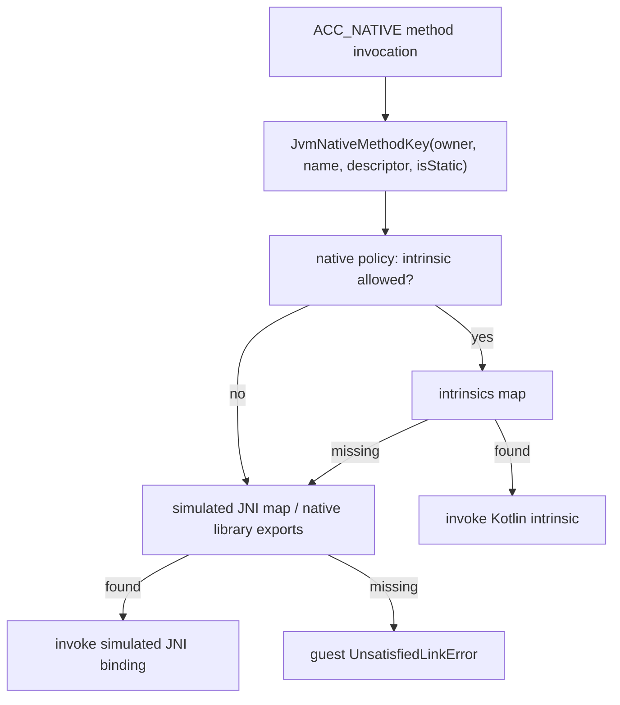

# Layered Native Resolver

This document defines the native-method resolution model used by interpreted guest classes. It preserves the design decision that VM intrinsics and simulated JNI are not independent modes; they are layered fallbacks inside one resolver.

## Resolution order

For a guest method marked `native`, the resolver must try layers in this order:

1. **VM intrinsic layer**: if policy allows this class/method, look up a Kotlin `JvmNativeMethodIntrinsic` implementation.
2. **Simulated JNI layer**: if no intrinsic is registered, look up a simulated JNI/native-library implementation that operates on guest state.
3. **Guest failure layer**: if no binding exists, throw guest `java/lang/UnsatisfiedLinkError`.

The current `JvmNativeMethodRegistry` already models two maps and resolves `intrinsics[key] ?: simulatedJni[key]`. Final work must add explicit policy checks, diagnostics, and native-library-backed simulated JNI registration.

## Native method identity

`JvmNativeMethodKey` is the canonical lookup key:

| Field | Meaning |
| --- | --- |
| `ownerClassName` | Internal JVM class name, e.g. `java/lang/System`. |
| `name` | Method name. |
| `descriptor` | JVM method descriptor. |
| `isStatic` | Distinguishes static and instance native entries. |

The key is built from `JvmResolvedMethod`, so linker/method-resolution correctness remains upstream of native dispatch.

## VM intrinsic layer

A VM intrinsic is Kotlin code that implements a selected native method directly against guest VM state. It is suitable for tightly VM-owned behavior such as:

- `Object.getClass`, `hashCode`, `clone`, `wait`, `notify`, `notifyAll`
- `System.arraycopy`, `identityHashCode`, `currentTimeMillis`, `nanoTime`
- class mirror queries
- `Throwable.fillInStackTrace`
- `String.intern`
- `Thread.currentThread` and `Thread.sleep`

The intrinsic layer must be whitelist-gated. A matching key alone is not enough; policy must allow that class/method to use a Kotlin intrinsic. This prevents user classes from shadowing platform names or accidentally receiving privileged VM behavior.

## Simulated JNI layer

Simulated JNI is the fallback for interpreted classes whose native method should remain inside modeled guest semantics. Implementations receive a `JvmNativeMethodContext` and `JvmNativeMethodInvocation`, then operate on:

- guest heap and object references
- guest class hierarchy
- guest static fields
- guest monitors
- guest strings, arrays, fields, and method IDs
- upcall handlers that re-enter interpreted execution

A simulated JNI binding can be provided by Kotlin helper code or by a native-library descriptor/downcall adapter that receives a simulated `JNIEnv` surface. In both cases, JNI helper calls must remain guest-scoped.

## Native libraries and symbol lookup

`jvm-jni` contains the native-library descriptor and symbol-resolution pieces:

- `JvmNativeLibraryDescriptor`: logical name, path, exports, and `JNI_OnLoad` symbol.
- `JvmNativeMethodExportDescriptor`: guest method to exported symbol mapping.
- `JvmNativeGuestMethodSignature`: guest native method identity for exports.
- `JvmNativeSymbolNameResolver`: short and long JNI symbol candidates using JNI name mangling.
- `JvmPanamaDowncallBackend`: resolves `JNI_OnLoad` and exported native symbols through `JvmNativeSymbolLookup`.

Native-library loading should populate the simulated JNI layer, not bypass it. Even when a real native export is downcalled through Panama, it must receive simulated handles/environment and return mapped guest values or guest exceptions.

## Invocation context

`JvmNativeMethodContext` is the shared context for both VM intrinsics and simulated JNI bindings. It carries heap, hierarchy, static fields, current class, monitors, time providers, stack-trace provider, sleep handler, and upcall handlers.

The context should be extended carefully rather than replaced. New fields must keep deterministic tests possible by allowing providers/fakes for wall-clock time, sleeping, threads, and stack traces.

## Upcalls

When native/JNI code calls back into a guest method, the call must use the interpreter's method invocation path:

1. Resolve the guest method through VM/linker metadata.
2. Create a guest frame with receiver and arguments.
3. Execute interpreted bytecode, including verification/linking/initialization semantics required by the engine.
4. Return a `JvmValue?` or propagate a guest exception to the native layer.

Upcalls must not use host reflection for interpreted classes.

## Events and diagnostics

Native resolution should emit events with enough detail for the GUI and tests:

| Event | Required detail |
| --- | --- |
| intrinsic selected | key, policy name, intrinsic implementation name |
| intrinsic skipped | key, policy reason |
| simulated JNI selected | key, binding source: Kotlin helper or native library export |
| JNI_OnLoad invoked | library logical name, path, result |
| native symbol resolved/failed | symbol candidates, library, address or error |
| upcall entered/returned | guest target, nesting depth, return/exception |
| missing binding | key and resulting guest `UnsatisfiedLinkError` |

## Design invariants

1. Intrinsic lookup is policy-gated and happens before simulated JNI.
2. Simulated JNI is the fallback for interpreted native methods, not a separate execution mode.
3. Missing bindings throw guest `UnsatisfiedLinkError`.
4. JNI handles and helper operations refer to guest state.
5. Downcalled native exports receive a simulated environment and cannot directly mutate unmodeled host VM state.
6. Host delegation is separate: only host-delegated classes cross the opaque host boundary.

## Known gaps / next work

- Add explicit policy objects around the existing intrinsic/simulated maps.
- Register native-library exports into the simulated JNI layer.
- Complete Panama invocation marshalling, return mapping, and thrown guest exception propagation.
- Expand native resolver coverage so every layer and fallback path is tested.
- Surface resolver events in `jvm-gui` alongside intrinsic and simulated JNI call views.
