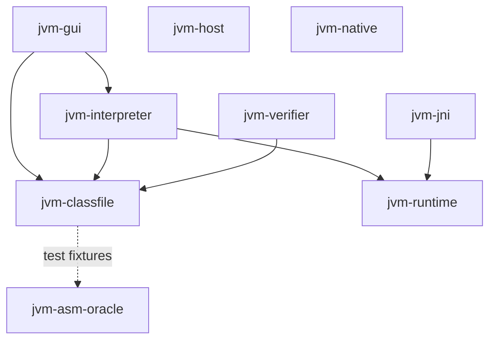
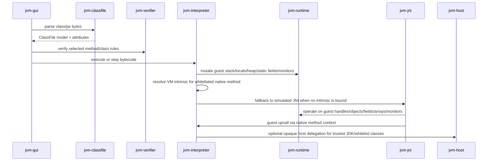

# Module Architecture

This project is a Pure-Kotlin JVM implementation with a JavaFX visualizer. The modules are intentionally split so the execution engine can be reused without the GUI, and so JVMS subsystems can be tested against focused conformance gates.

## Module graph

The Gradle module list is the source of truth:

- `jvm-classfile`
- `jvm-verifier`
- `jvm-runtime`
- `jvm-interpreter`
- `jvm-host`
- `jvm-native`
- `jvm-jni`
- `jvm-gui`
- `jvm-asm-oracle`

## Responsibilities

| Module | Responsibility | Dependency rule |
| --- | --- | --- |
| `jvm-classfile` | Own parser/writer/model for classfile bytes, constant pool, attributes, code attributes, and offset-aware diagnostics. | Must not expose ASM in production APIs. Tests may use `jvm-asm-oracle`. |
| `jvm-verifier` | Type checking, StackMapTable expansion, control-flow and verifier rule helpers. | Depends on `jvm-classfile`; verifier rules stay separate from bytecode execution. |
| `jvm-runtime` | Guest runtime state: values, heap, static fields, class hierarchy, local variables, operand stack, monitor state, and guest linkage errors. | No parser or GUI dependency. |
| `jvm-interpreter` | Bytecode decode/execute loop, opcode metadata, method invocation, native method registry, VM intrinsics, and simulated-JNI upcall hooks. | Depends on `jvm-classfile` and `jvm-runtime`; does not depend on JavaFX. |
| `jvm-jni` | Guest-scoped JNI model: handles, class/member lookup, field/string/array/monitor helpers, native library descriptors, JNI symbol names, and Panama downcall adapter surface. | Depends on `jvm-runtime`; simulated helpers operate on guest state. |
| `jvm-host` | Reserved boundary for opaque host-JVM class delegation policy and bridge implementation. | Must remain an explicit boundary; guest user code is interpreted by default. |
| `jvm-native` | Reserved boundary for native integration packaging/runtime concerns beyond simulated JNI. | Must not leak native side effects into instruction-level guest execution without a modeled boundary. |
| `jvm-gui` | JavaFX visualizer: classpath/import views, class/member/method/code views, debugger controls, event panels, host/native/JNI boundary visualization. | Depends on `jvm-classfile` and `jvm-interpreter`; GUI consumes snapshots/events rather than owning VM semantics. |
| `jvm-asm-oracle` | Test-only oracle utilities: ASM facts, `javap`, Java fixture compilation, JVMS/HotSpot corpora. | ASM is allowed here as oracle/fixture support only. |

## Execution layering

## Architectural invariants

1. **Self-owned classfile implementation**: production parsing/writing lives in `jvm-classfile`. ASM is an oracle, not the implementation.
2. **Guest semantics before visualization**: GUI panels render state/events produced by engine modules; GUI code does not define bytecode, verifier, class loading, native, or JNI semantics.
3. **Default interpreted execution**: guest application classes remain interpreted unless a host delegation policy explicitly allows a class/method boundary.
4. **Layered native resolution**: for native methods, resolve Kotlin VM intrinsics first when policy allows, then simulated JNI, then guest `UnsatisfiedLinkError`.
5. **Simulated JNI remains guest-scoped**: `FindClass`, IDs, fields, strings, arrays, monitors, and upcalls operate on guest runtime state instead of escaping to host JVM semantics.
6. **Coverage ledgers are live artifacts**: `docs/spec-coverage.md` records implemented surfaces and explicit gaps; coverage gate tests fail when a classified surface drifts silently.

## Current intentionally incomplete boundaries

- `jvm-host` and `jvm-native` are placeholders for later implementation slices; they exist to keep the API and dependency direction explicit.
- Full JVMS class loading/linking/initialization state machines are not complete. Current coverage gates name those gaps explicitly.
- GUI event streams exist for many boundaries, but the engine still needs complete event production for all JVMS transitions.