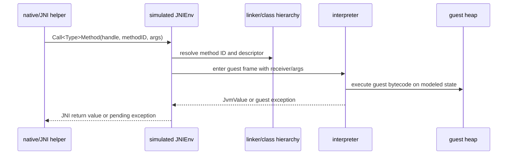

# Simulated JNI Architecture

This document describes the simulated JNI layer for native methods that belong to interpreted guest classes. Simulated JNI keeps JNI behavior inside the VM's modeled guest state instead of letting native/helper code escape into host JVM semantics.

## Role in the VM

Simulated JNI is the second layer of native resolution:

1. A whitelisted VM intrinsic may implement a native method directly in Kotlin.
2. If no intrinsic is found, simulated JNI attempts to implement the native method through guest-scoped JNI helpers or native-library exports using a simulated `JNIEnv`.
3. If no binding exists, the VM throws guest `java/lang/UnsatisfiedLinkError`.

This makes simulated JNI the general fallback for native methods in interpreted classes.

## Core objects

| Object | Responsibility |
| --- | --- |
| `JvmSimulatedJniEnvironment` | Implements JNI-style helpers over guest heap, hierarchy, statics, monitors, strings, arrays, fields, and IDs. |
| `JvmJniHandleTable` | Allocates positive integer handles for guest object references, class handles, method IDs, and field IDs. |
| `JvmNativeMethodContext` | Carries shared VM state and upcall handlers from the interpreter into native bindings. |
| `JvmNativeMethodInvocation` | Carries receiver and argument `JvmValue`s for a native call. |
| `JvmNativeLibraryDescriptor` | Describes native exports and optional `JNI_OnLoad` for library-backed simulated JNI. |
| `JvmPanamaDowncallBackend` | Resolves native symbols for future downcalls while preserving simulated handle/environment boundaries. |

## Environment state

`JvmSimulatedJniEnvironment` is constructed from the same guest state used by the interpreter:

- `JvmClassHierarchy` for class/member lookup and assignability
- `JvmHeap` for objects, arrays, strings, class mirrors, and Throwable payloads
- `JvmStaticFields` for static field access
- `JvmJniHandleTable` for object/class/method/field references
- `JvmMonitorState` and current thread ID for monitor helpers

It must not use host reflection to resolve interpreted guest methods/classes.

## Handle model

JNI references are represented as `JvmJniHandleId`, a positive integer handle. The handle table stores typed entries:

- object handle -> `JvmObjectReferenceValue`
- class handle -> internal class name
- method ID handle -> `JvmResolvedMethod`
- field ID handle -> `JvmResolvedField`

Resolving a handle with the wrong kind throws a deterministic handle type error. Deleting a local handle removes it from the live table; later use of that handle fails.

Final work should extend the table with full JNI local-frame and global/weak-global lifetime rules while preserving typed resolution.

## Helper families

The current simulated environment models these JNI helper groups:

| Family | Examples |
| --- | --- |
| Class and type lookup | `FindClass`, `GetObjectClass`, `IsInstanceOf` |
| Method IDs | `GetMethodID`, `GetStaticMethodID` |
| Field IDs | `GetFieldID`, `GetStaticFieldID` |
| Strings | `NewString`, `NewStringUTF`, `GetStringChars`, `GetStringUTFChars`, release helpers |
| Arrays | primitive/reference array creation, length, element copy helpers, region helpers, release modes |
| Fields | object and primitive instance/static field get/set helpers |
| Monitors | `MonitorEnter`, `MonitorExit` over guest monitor state |
| Native library surface | descriptors, `JNI_OnLoad`, JNI symbol-name candidates, symbol lookup/downcall target descriptors |

The helpers use guest exceptions such as `NoClassDefFoundError`, `NoSuchMethodError`, and `NoSuchFieldError` where lookup fails.

## Upcall rule

JNI upcalls are the key semantic boundary. If native code/helper calls `Call<Type>Method`, `CallStatic<Type>Method`, or related methods targeting an interpreted class, the simulated environment must route the call back into the VM interpreter:

Upcalls must not call host methods for interpreted guest classes. They re-enter the same execution, class-loading, linking, initialization, verification, exception, and event semantics as ordinary bytecode invocation.

## Native-library-backed simulated JNI

A real native export can still be used, but it must be wrapped as simulated JNI:

1. Resolve the export with `JvmNativeSymbolNameResolver` candidates or explicit `JvmNativeMethodExportDescriptor`.
2. Bind `JNI_OnLoad` if present.
3. Pass a simulated `JNIEnv`/VM surface whose function table delegates to `JvmSimulatedJniEnvironment` and upcall handlers.
4. Marshal primitive arguments directly and object references as handles.
5. Map return values and pending exceptions back into guest `JvmValue` or guest Throwable state.

The native library must not receive raw host object references for guest objects.

## Exceptions and pending state

Full JNI requires pending-exception tracking (`ExceptionCheck`, `ExceptionOccurred`, `Throw`, `ThrowNew`, `ExceptionClear`) and rules that restrict most JNI calls while an exception is pending. The current environment already throws deterministic guest/runtime exceptions for many lookup and access failures; final work should model pending JNI exception state explicitly.

## Coverage and diagnostics

Simulated JNI coverage is guarded by focused `JvmSimulatedJniEnvironmentTest` cases and spec coverage gates. Tests should cover:

- valid and invalid handles
- class, method, and field lookup success/failure
- string modified-UTF behavior
- primitive and reference arrays, region bounds, and release modes
- instance/static object and primitive fields
- monitor enter/exit ownership behavior
- native upcalls re-entering interpreted methods
- native-library export binding and missing symbol failures

Each simulated JNI call should be observable in GUI/event streams with nesting depth for upcalls.

## Design invariants

1. Simulated JNI operates on guest heap/class/static/monitor state.
2. Handles abstract guest references; host objects are not leaked as guest references.
3. Upcalls re-enter the interpreter.
4. Intrinsics are checked before simulated JNI, but missing intrinsics fall back here.
5. Missing simulated bindings produce guest `UnsatisfiedLinkError` through the layered resolver.
6. Downcalls receive a simulated environment, not the host JVM's real `JNIEnv`.

## Known gaps / next work

- Add full local/global/weak-global reference lifetime semantics.
- Add pending-exception APIs and pending-exception call restrictions.
- Complete `Call<Type>Method` and `CallStatic<Type>Method` families through interpreter upcalls.
- Finish native downcall marshalling and return/exception mapping.
- Add GUI visualization for simulated JNI calls and nested upcalls.
