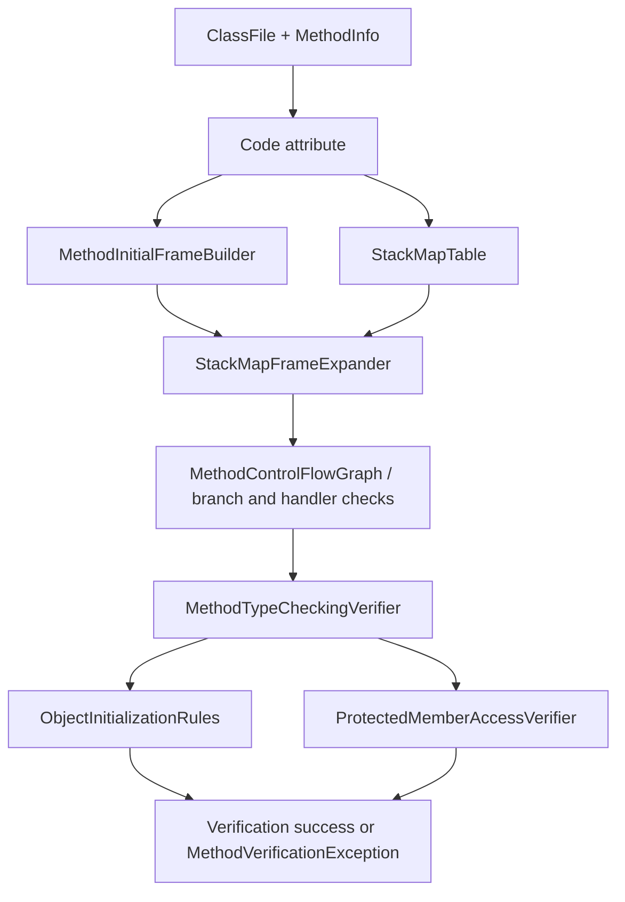

# Verifier Design

This document describes the current `jvm-verifier` design and the target shape for full JVMS verifier coverage. The verifier is a semantic gate for class and method safety; it does not execute bytecode and does not mutate guest runtime state.

## Scope

`jvm-verifier` targets JVMS 4.10 verification rules, including:

- method descriptor to initial frame construction
- `StackMapTable` frame expansion and offset calculation
- verification types, category-1/category-2 slot accounting, locals, and operand stack constraints
- instruction transfer checks for verifier-supported opcodes
- control-flow/resource checks around method code, branches, handlers, and frame join points
- object initialization and uninitialized-value rules
- protected member access checks

The verifier consumes `jvm-classfile` models. It stays independent from the interpreter so invalid bytecode can be rejected before execution.

## Pipeline

The intended order is:

1. Locate the method `Code` attribute and structural classfile facts.
2. Build the initial local-variable frame from method access flags and descriptors.
3. Expand `StackMapTable` compressed frames into absolute `VerificationFrameState` entries.
4. Validate code bounds, branch targets, exception-handler targets, and frame availability at required offsets.
5. Run instruction transfer checks against locals, operand stack, constant-pool references, `max_stack`, and `max_locals`.
6. Apply object-initialization and protected-access rules that need context beyond a single stack operation.
7. Report a verifier diagnostic as a guest verification failure, not as host JVM behavior.

## Core models

| Model | Role |
| --- | --- |
| `VerificationType` | Internal verifier type lattice, including primitives, object references, null, top, uninitialized values, and category width. |
| `VerificationFrameState` | Absolute bytecode offset plus locals and operand stack after `StackMapTable` expansion. |
| `VerifierLocalVariables` | Immutable local-slot helper that validates index bounds and category-2 placement. |
| `VerifierOperandStack` | Immutable operand-stack helper that validates stack depth, category width, and assignability while simulating verifier transfers. |
| `VerificationTypeHierarchy` | Assignability and common-supertype surface for reference verification. |
| `MethodVerificationException` | Focused verification failure used by rule helpers and tests. |

`VerificationType` deliberately differs from runtime values: verifier facts describe what may be on the stack or in locals, not the concrete guest object/value currently held during execution.

## Instruction transfer checks

`MethodTypeCheckingVerifier` dispatches by opcode and delegates families of rules to focused helpers. Current helpers cover constant pushes, local loads/stores, array load/store shapes, stack-manipulation forms, arithmetic/conversion/comparison families, returns, branches, switch instructions, field access, method invocation, object creation, arrays, `wide`, `ret`, and monitor instructions as they are implemented.

Each transfer check follows the same pattern:

1. Start from the `VerificationFrameState` for the instruction offset.
2. Pop required operand types from `VerifierOperandStack`.
3. Validate local indices, constant-pool entry kind, descriptor shape, branch target, or method/class context as needed.
4. Push the verifier result type and enforce `max_stack`.
5. Throw `MethodVerificationException` with a rule-specific message when the simulated transfer is invalid.

This is intentionally separate from the interpreter opcode table: an opcode can be decoded and even have execution scaffolding while still requiring additional verifier rule coverage.

## StackMapTable handling

`StackMapFrameExpander` converts compressed StackMapTable entries into absolute frames using JVMS offset-delta rules. It handles same-frame, same-locals-one-stack-item, chop, append, and full-frame shapes.

The expanded frames are the verifier's anchor points for type checking and future frame-merge work. Category-2 values are represented by their verifier type and slot width; helpers enforce width-dependent local and stack constraints.

## Current coverage gates

`VerifierRuleCoverageTest` is the live guardrail for verifier implementation drift. It enumerates verifier source files and requires each rule-oriented file to be classified as either:

- covered by a focused test class, or
- internal support code with an explicit reason.

The spec coverage phase also tracks verifier rule coverage in `docs/spec-coverage.md`, so adding a new verifier helper should add both focused tests and ledger updates.

## Design invariants

1. The verifier only reads classfile/verifier models; it does not call host reflection to decide guest validity.
2. ASM is not part of verifier production APIs. ASM-derived facts belong in test/oracle modules only.
3. Verification errors must be deterministic and source-grounded enough for GUI diagnostics.
4. Instruction verification and instruction execution evolve independently but share opcode metadata expectations.
5. Host delegation does not bypass verification for classes selected for interpreted guest execution.
6. Native method resolution is outside verifier scope except for validating method flags/descriptors and invocation shape.

## Known gaps / next work

- Full JVMS 4.10 frame merge and class-hierarchy assignability remain incremental work.
- Some linker-dependent checks require tighter integration with the class loading and resolution layers.
- Object initialization, protected member access, legacy `jsr`/`ret`, and exception-handler edge checks need continued expansion against malformed and HotSpot differential fixtures.
- GUI verifier diagnostics should carry stable rule identifiers once the verifier ledger reaches complete normative coverage.
